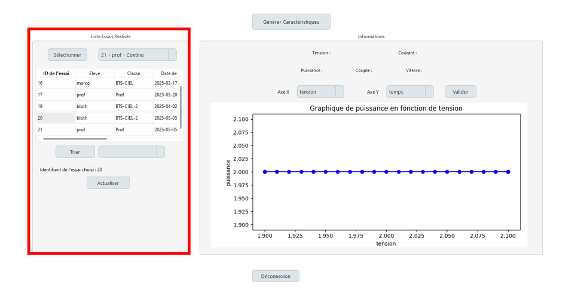
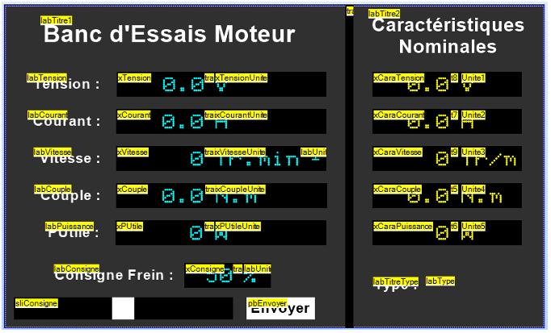
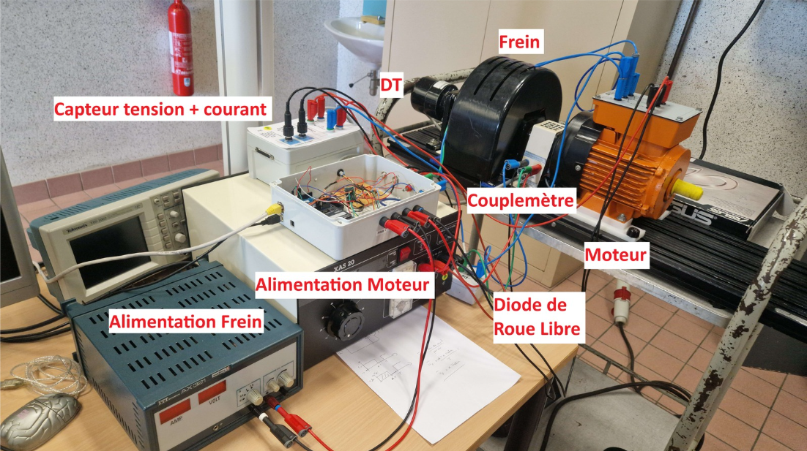

# ⚙️ Motor Test Bench Acquisition System

> Developed as part of the **BTS CIEL 2025** final project  
> Lycée Pierre Mendès France — Épinal

---

## 🧠 Project Overview

This system aims to acquire, monitor, and control electrical and mechanical parameters of electric motors under test using a modern, connected solution. It replaces outdated educational systems such as *Modelec*, *Modmeca*, and *Modsimet*.

Key features include:

- Acquisition of **voltage**, **current**, **torque**, and **speed**
- Real-time display on **touchscreen** and **PC interface**
- **Manual or profile-based control** of a powder brake
- **Secure login system** with **2FA**
- **Automated storage** of test data in a local database
- Generation of motor **characteristic curves**

---

## 👨‍💻 Team Members

| Name               | Role                                                                                     |
|--------------------|------------------------------------------------------------------------------------------|
| [@Ahmet](https://github.com/afturkel)   | Embedded acquisition system (Arduino MEGA + sensors)                |
| [@Ewan](https://github.com/Narusakagif) | Desktop app development, database, authentication system            |
| [@Benjamin](https://github.com/CND-cyb) | Touchscreen UI (ESP32 + Nextion), MQTT integration, user interface  |

---

## 🔍 Features

✅ - Real-time acquisition every **0.5s**  
✅ - Dual interface: **PC app** and **Nextion touchscreen**  
✅ - **Manual / Profile** brake control (via PWM)  
✅ - Secure **login system** with **2FA (TOTP)**  
✅ - **Data export + historic analysis**  
✅ - **Motor characteristic curve** generation  
✅ - Intuitive **GUI for students & teachers**

---

## 📸 Screenshots & UI Preview

### 🖥️ PC Application (Python + Qt)

### 📱 Touchscreen UI (Nextion + ESP32)

### 🔨 Engine Test Bench (Nextion + ESP32)

---

## 🙌 Acknowledgements

Thanks to our professors and technical mentors at Lycée Pierre Mendès France for their guidance throughout this project.
